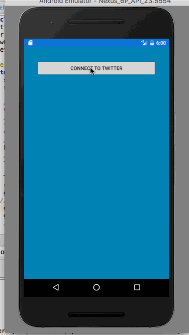
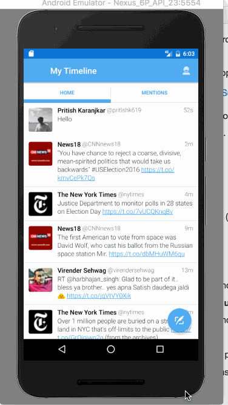

# TweetsFragment

Time spent: 8 hours

## User Stories

The following **required** user stories are completed:

* [X] Includes all required user stories from Week 3 Twitter Client
* [X] User can switch between Timeline and Mention views using tabs. (1 point)
* [X] User can view their home timeline tweets.
* [X] User can view the recent mentions of their username.
* [X] User can navigate to view their own profile (1 point)
* [X] User can see picture, tagline, # of followers, # of following, and tweets on their profile.
* [X] User can click on the profile image in any tweet to see another user's profile. (1 point)
* [X] User can see picture, tagline, # of followers, # of following, and tweets of clicked user.
* [X] Profile view should include that user's timeline
* [X] User can infinitely paginate any of these timelines (home, mentions, user) by scrolling to the bottom (1 point)

The following **optional** advanced user stories are completed :

* [X] User can click on a tweet to be taken to a "detail view" of that tweet (1 point)
* [X] Improve the user interface and theme the app to feel "twitter branded" (1 to 5 points)

## Video Walkthrough 

